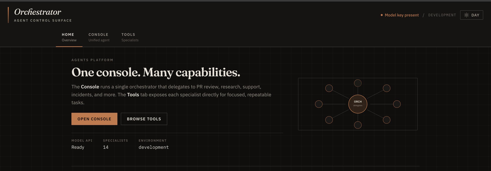
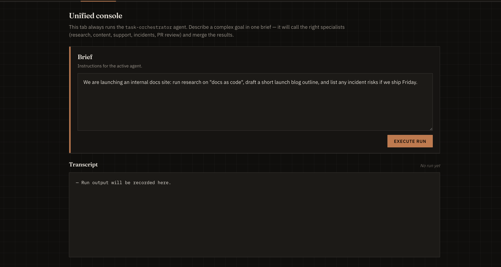
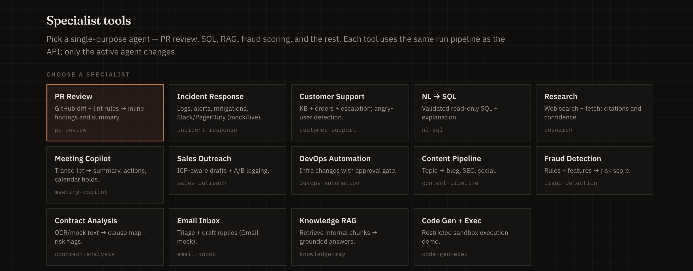

# Orchestrator Studio

A **command-center** for the [`agents-platform`](../agents-platform) package: a **React** UI plus an **Express** API that lists agents, validates requests, rate-limits writes, and runs the [OpenAI Agents SDK](https://openai.github.io/openai-agents-js/) with timeouts and concurrency limits.

## Screenshots

Place PNG/WebP files in [`docs/screenshots/`](./docs/screenshots/) (this folder is tracked; large binaries stay out of history if you prefer Git LFS). Suggested names:

| File | What to capture |
| ---- | ---------------- |
| `home.png` | **Home** tab — hero, features, or full page |
| `console.png` | **Console** tab — brief + transcript after a run |
| `tools.png` | **Tools** tab — grid + workspace |

**Home**



**Console** (unified orchestrator)



**Tools** (specialist agents)



> If images are missing locally, you’ll see a broken icon in some viewers until you add the files above (or adjust the paths).

---

## Repository layout

```text
orchestrator-studio/
├── README.md
├── docs/
│   └── screenshots/          # optional UI captures (see Screenshots)
├── index.html
├── vite.config.ts            # dev server; proxies /api → backend
├── package.json
├── tsconfig.json
├── server/                   # Express API
│   ├── index.ts
│   ├── app.ts
│   ├── config/env.ts
│   ├── middleware/
│   ├── routes/
│   ├── services/agentService.ts
│   ├── types/api.ts
│   └── utils/
└── src/                      # React app
    ├── main.tsx
    ├── App.tsx
    ├── layout/AppShell.tsx
    ├── pages/                # HomePage, ConsolePage, ToolsPage
    ├── context/AppStateContext.tsx
    ├── hooks/useAgentRunner.ts
    ├── theme/ThemeProvider.tsx
    ├── api/
    ├── components/
    └── constants/
```

---

## Prerequisites

- **Node.js** 18+ (20+ recommended)
- **npm** 9+
- **`OPENAI_API_KEY`** for `@openai/agents`

---

## Setup (quick)

### 1. Install from monorepo root

```bash
cd "/path/to/Ai Agent sdk"
npm install
```

### 2. Build `agents-platform` (required for the API)

```bash
npm run build -w agents-platform
```

### 3. Environment

Create **`.env`** at the **repository root** (recommended) or in `orchestrator-studio/`.

| Variable | Required | Description |
| -------- | -------- | ----------- |
| `OPENAI_API_KEY` | Yes | OpenAI API key |

Optional API tuning: `PORT` (default `8787`), `CORS_ORIGIN`, `BODY_LIMIT`, `MAX_CONCURRENT_RUNS`, `RUN_SOFT_TIMEOUT_MS`, `RATE_LIMIT_WINDOW_MS`, `RATE_LIMIT_MAX`, `TRUST_PROXY`. See table in an earlier version or `server/config/env.ts`.

Load order: repo root `.env`, then `orchestrator-studio/.env` (later wins).

### 4. Run (one command = API + UI)

```bash
cd orchestrator-studio
npm run dev
```

- **App:** [http://localhost:5173](http://localhost:5173)
- **API:** [http://127.0.0.1:8787](http://127.0.0.1:8787)

From repo root:

```bash
npm run dev -w orchestrator-studio
```

**Debug one process only:** `npm run dev:api` or `npm run dev:ui`.

### 5. Production UI build

```bash
cd orchestrator-studio
npm run build
```

Static output: `dist/`. Serve it and run the API separately; put **`/api`** behind a reverse proxy to the Node server, or configure CORS.

---

## How to use (step by step)

### First launch

1. Complete **Setup** and run **`npm run dev`** inside `orchestrator-studio`.
2. Open **http://localhost:5173**.
3. Check the **masthead**: it should show **Model key present** if `OPENAI_API_KEY` is loaded. If it says **Awaiting credentials**, fix `.env` and restart `npm run dev`.

### Navigation (three tabs)

| Route | Tab | Use when |
| ----- | --- | -------- |
| `/` | **Home** | Read overview, capability map, and jump to Console or Tools |
| `/console` | **Console** | One **natural-language goal** that should **span multiple skills** (research + content + incident, etc.). Always uses the **`task-orchestrator`** agent. |
| `/tools` | **Tools** | **One specialist** at a time (PR review, RAG, SQL, support, …). Pick a tile, edit the **Brief**, run. |

### Running a job (Console or Tools)

1. Go to **Console** or **Tools**.
2. The **Brief** field loads a **sample prompt** when you change agent (Tools) or open Console.
3. Edit the text: include **goal**, **constraints**, and any **IDs** (order id, repo/PR, transaction id, etc.) the tools expect.
4. Click **Execute run**.
5. Read the **Transcript**: model output, **elapsed ms**, and **request id** (matches API `x-request-id` for logs).

### Theme

Use **Day / Night** in the masthead. Preference is stored as `orchestrator-theme` in `localStorage`; `index.html` sets the initial theme to reduce flash.

### HTTP API (automation)

| Method | Path | Purpose |
| ------ | ---- | ------- |
| `GET` | `/api/health` | Liveness |
| `GET` | `/api/ready` | **503** if key missing |
| `GET` | `/api/meta` | Version, uptime, env |
| `GET` | `/api/agents` | List agents |
| `GET` | `/api/agents/:id` | One agent |
| `POST` | `/api/run` | Run agent |

**Body:**

```json
{
  "agentId": "task-orchestrator",
  "message": "Your task"
}
```

**Success:** `{ "output", "requestId", "durationMs" }`.

**curl example:**

```bash
curl -sS http://127.0.0.1:8787/api/agents | jq
curl -sS -X POST http://127.0.0.1:8787/api/run \
  -H 'Content-Type: application/json' \
  -d '{"agentId":"research","message":"What is TypeScript? One short paragraph."}'
```

---

## Troubleshooting

| Issue | What to try |
| ----- | ----------- |
| UI can’t load agents | Ensure **`npm run dev`** (or `dev:api`) is running; API on **8787**. |
| **503** on run | Set **`OPENAI_API_KEY`** and restart the API. |
| Import errors after pull | **`npm run build -w agents-platform`**. |
| Too many **429**s | Raise **`RATE_LIMIT_MAX`** or widen **`RATE_LIMIT_WINDOW_MS`** in `.env`. |

---

## Improvements & ideas (for discussion)

These are **directions**, not a commitment—pick what matches your product goals.

1. **Authn / multi-tenant** — API keys or OAuth on `/api/run`; per-tenant agent allowlists and usage quotas.
2. **Streaming** — Stream model tokens to the Transcript (SSE/WebSocket) instead of waiting for the full `finalOutput`.
3. **Run history** — Persist runs (Postgres/SQLite) keyed by `requestId` for replay, compare, and audit.
4. **Tool traces** — Surface which tools the agent called and with what arguments (where the SDK exposes this).
5. **E2E tests** — Playwright against the UI; supertest against the API with a mocked model layer.
6. **Real integrations** — Swap demo tools for live GitHub, Slack, DB read-only roles, vector DB—behind feature flags.
7. **Deployment** — Dockerfile + compose (UI static + API), or single Fly.io/Render service with `vite preview` + API; document `BASE_URL` for React Router if not served from `/`.
8. **Observability** — Structured logging (pino), OpenTelemetry traces from API into your APM.
9. **Safety** — Stricter allowlists for `agentId` per environment; content policies on user prompts for public demos.
10. **UX** — Cancel in-flight run, duplicate last prompt, export transcript as Markdown, keyboard shortcut to run.

If you tell us your priority (e.g. “streaming first” or “deploy to X”), the next steps can be ordered as a concrete roadmap.

---

## Related

- Agent definitions: [`../agents-platform`](../agents-platform)
- OpenAI Agents SDK: [openai.github.io/openai-agents-js](https://openai.github.io/openai-agents-js/)
